# doqify ⚡

**doqify** es un asistente inteligente de documentos basado en RAG (Retrieval-Augmented Generation) que te permite subir archivos PDF o pegar texto plano para realizar consultas inteligentes en lenguaje natural, obteniendo respuestas precisas sustentadas en tu propio contenido.

Esta aplicación ha sido migrada de una arquitectura externa basada en webhooks de n8n a una solución **100% nativa en código dentro de Next.js** (App Router), utilizando tecnologías gratuitas y eficientes que permiten hospedar todo el proyecto sin coste alguno.

---

## 🚀 Características Principales

- **Arquitectura Local y Autohospedada:** Toda la lógica de procesamiento, fragmentación, generación de embeddings y chat corre dentro de Route Handlers de Next.js. Sin depender de servidores de n8n externos.
- **Diseño Moderno y Premium:** Interfaz oscura glassmórfica (`backdrop-blur`) con sutiles halos de luz radiales, micro-animaciones fluidas y estados visuales responsivos (drag & drop interactivo con validación instantánea).
- **Mapeo Vectorial de Alto Nivel:** Integración nativa con **Supabase (pgvector)** para almacenar vectores de 1024 dimensiones.
- **Procesamiento de PDF Resiliente:** Extracción y segmentación semántica de documentos PDF a través de un procesador de texto personalizado con ventanas de solapamiento (overlap).
- **Modelos de IA Gratuitos:**
  - **Cohere API** (`embed-multilingual-v3.0`): Generación de embeddings vectoriales multilingües de alta fidelidad.
  - **Groq API** (`llama-3.3-70b-versatile`): Generación de respuestas contextuales ultrarrápidas.

---

## 📐 Flujo de Arquitectura (RAG)

```mermaid
graph TD
    %% Flujo de Indexación
    subgraph Indexacion [1. Indexación del Documento]
        A[PDF / Texto] --> B[Extractor de Texto]
        B --> C[Segmentación en Chunks con Overlap]
        C --> D[Cohere API: embed-multilingual-v3.0]
        D -->|Vectores 1024d| E[(Supabase pgvector)]
    end

    %% Flujo de Consulta
    subgraph Consulta [2. Recuperación y Generación]
        F[Pregunta del Usuario] --> G[Cohere API: Embed Query]
        G -->|Embedding de Consulta| H{RPC match_documents}
        E -->|Búsqueda Semántica| H
        H -->|Top 5 Chunks Relacionados| I[Inyección en System Prompt]
        I --> J[Groq API: Llama 3.3 70B]
        J --> K[Respuesta en Contexto + Fuentes]
    end
    
    style Indexacion fill:#1e1e24,stroke:#7c3aed,stroke-width:2px
    style Consulta fill:#1e1e24,stroke:#10b981,stroke-width:2px
```



---

## 🛠️ Configuración de la Base de Datos (Supabase)

Para preparar tu base de datos de Supabase, ve al **SQL Editor** en tu panel de control y ejecuta la siguiente consulta para habilitar la extensión vectorial, crear la tabla de almacenamiento y definir la función de búsqueda por similitud de coseno:

```sql
-- 1. Habilitar la extensión de vectores
create extension if not exists vector;

-- 2. Crear la tabla para guardar fragmentos y embeddings (1024 dimensiones para Cohere v3)
create table if not exists documents (
  id uuid default gen_random_uuid() primary key,
  name text not null,
  content text not null,
  embedding vector(1024),
  created_at timestamp with time zone default timezone('utc'::text, now()) not null
);

-- 3. Crear función RPC para búsqueda por similitud de coseno
create or replace function match_documents (
  query_embedding vector(1024),
  match_threshold float,
  match_count int
)
returns table (
  id uuid,
  name text,
  content text,
  similarity float
)
language sql stable
as $$
  select
    documents.id,
    documents.name,
    documents.content,
    1 - (documents.embedding <=> query_embedding) as similarity
  from documents
  where 1 - (documents.embedding <=> query_embedding) > match_threshold
  order by documents.embedding <=> query_embedding
  limit match_count;
$$;
```

---

## ⚙️ Configuración del Entorno

1. Copia el archivo de ejemplo de variables de entorno:
   ```bash
   cp .env.example .env.local
   ```
2. Abre `.env.local` y rellena las credenciales requeridas:
   ```ini
   # Supabase
   NEXT_PUBLIC_SUPABASE_URL=https://tu-proyecto.supabase.co
   SUPABASE_SERVICE_ROLE_KEY=tu-clave-secreta-service-role

   # APIs de Inteligencia Artificial
   COHERE_API_KEY=tu-clave-cohere-gratis
   GROQ_API_KEY=gsk_tu-clave-groq-gratis
   ```
   *Nota: Consigue tu API Key de Cohere gratis en [dashboard.cohere.com](https://dashboard.cohere.com/) y la de Groq en [console.groq.com](https://console.groq.com/).*

---

## 💻 Inicio Rápido

1. Instala las dependencias necesarias:
   ```bash
   pnpm install
   ```
2. Levanta el servidor de desarrollo:
   ```bash
   pnpm run dev
   ```
3. Abre [http://localhost:3000](http://localhost:3000) en tu navegador.

---

## 🤖 Pautas para Agentes de Desarrollo

Si eres un asistente AI y estás haciendo cambios en este repositorio, recuerda que existen **reglas de verificación obligatorias** especificadas en [AGENTS.md](file:///c:/Users/Usuario/Desktop/Proyects/doqify/AGENTS.md). Antes de dar por completado un cambio, debes verificar que los siguientes comandos se ejecuten sin fallos:
- `pnpm run lint` — Ejecuta las revisiones de ESLint.
- `pnpm exec tsc --noEmit` — Valida la integridad del tipado con TypeScript.
- `pnpm run build` — Compila la aplicación para producción con Next.js.
