# doqify ⚡

**doqify** is an intelligent document assistant based on RAG (Retrieval-Augmented Generation) that allows you to upload PDF files or paste plain text to make natural language queries, obtaining precise answers backed exclusively by your own content.

This application runs as a **100% native in-code solution within Next.js** (App Router), utilizing free developer tier services to allow hosting the entire project at zero cost.

---

## 🚀 Key Features

- **Local & Self-Hosted Architecture:** All file processing, text chunking, embedding generation, and chat matching logic runs inside Next.js Route Handlers. No external n8n or workflow tools needed.
- **Premium Modern Design:** Dark glassmorphic (`backdrop-blur`) workspace with custom glowing halos, fluid micro-animations, and responsive drag-and-drop file inputs with real-time feedback.
- **High-Fidelity Vector Storage:** Native integration with **Supabase (pgvector)** to store and search 1024-dimension embeddings.
- **Resilient PDF Extraction:** Text extraction and semantic chunking with overlapping windows to preserve context across chunks.
- **Free-tier AI Integrations:**
  - **Cohere API** (`embed-multilingual-v3.0`): Generates state-of-the-art multilingual text embeddings.
  - **Groq API** (`llama-3.3-70b-versatile`): Generates fast, high-quality contextual answers.

---

## 📐 RAG Architecture Flow

```mermaid
graph TD
    %% Indexing Flow
    subgraph Indexing [1. Document Indexing]
        A[PDF / Text Input] --> B[Text Extractor]
        B --> C[Semantic Chunker with Overlap]
        C --> D[Cohere API: embed-multilingual-v3.0]
        D -->|1024d Vectors| E[(Supabase pgvector)]
    end

    %% Query Flow
    subgraph Querying [2. Retrieval & Generation]
        F[User Question] --> G[Cohere API: Embed Query]
        G -->|Query Embedding| H{RPC match_documents}
        E -->|Semantic Search| H
        H -->|Top 5 Context Chunks| I[System Prompt Injection]
        I --> J[Groq API: Llama 3.3 70B]
        J --> K[Contextual Answer + Sources]
    end
    
    style Indexing fill:#1e1e24,stroke:#7c3aed,stroke-width:2px
    style Querying fill:#1e1e24,stroke:#10b981,stroke-width:2px
```



---

## 🛠️ Database Setup (Supabase)

To prepare your Supabase instance, navigate to the **SQL Editor** in your Supabase dashboard and run the following script. This will enable the vector extension, create the documents table, and set up the similarity matching RPC function:

```sql
-- 1. Enable the vector extension
create extension if not exists vector;

-- 2. Create the table for storing document chunks and embeddings (1024 dimensions for Cohere v3)
create table if not exists documents (
  id uuid default gen_random_uuid() primary key,
  name text not null,
  content text not null,
  embedding vector(1024),
  created_at timestamp with time zone default timezone('utc'::text, now()) not null
);

-- 3. Create the cosine similarity search function (RPC)
create or replace function match_documents (
  query_embedding vector(1024),
  match_threshold float,
  match_count int
)
returns table (
  id uuid,
  name text,
  content text,
  similarity float
)
language sql stable
as $$
  select
    documents.id,
    documents.name,
    documents.content,
    1 - (documents.embedding <=> query_embedding) as similarity
  from documents
  where 1 - (documents.embedding <=> query_embedding) > match_threshold
  order by documents.embedding <=> query_embedding
  limit match_count;
$$;
```

---

## ⚙️ Environment Configuration

1. Copy the environment variables example template:
   ```bash
   cp .env.example .env.local
   ```
2. Open `.env.local` and fill in your credentials:
   ```ini
   # Supabase Configuration
   NEXT_PUBLIC_SUPABASE_URL=https://your-project.supabase.co
   SUPABASE_SERVICE_ROLE_KEY=your-supabase-private-service-role-key

   # AI API Configuration
   COHERE_API_KEY=your-cohere-api-key
   GROQ_API_KEY=your-groq-api-key
   ```
   *Note: Obtain your free API keys from [dashboard.cohere.com](https://dashboard.cohere.com/) and [console.groq.com](https://console.groq.com/).*

---

## 💻 Getting Started

1. Install project dependencies:
   ```bash
   pnpm install
   ```
2. Run the local development server:
   ```bash
   pnpm run dev
   ```
3. Open [http://localhost:3000](http://localhost:3000) in your browser.

---

## 🤖 Guidelines for AI Agents

If you are an AI assistant editing this codebase, please note that there are **strict verification guidelines** configured in [AGENTS.md](file:///c:/Users/Usuario/Desktop/Proyects/doqify/AGENTS.md). Before presenting a solution or completing your turn, you MUST run:
- `pnpm run lint` — to execute ESLint checks.
- `pnpm exec tsc --noEmit` — to run TypeScript compiler typechecks.
- `pnpm run build` — to test the Next.js production build.
